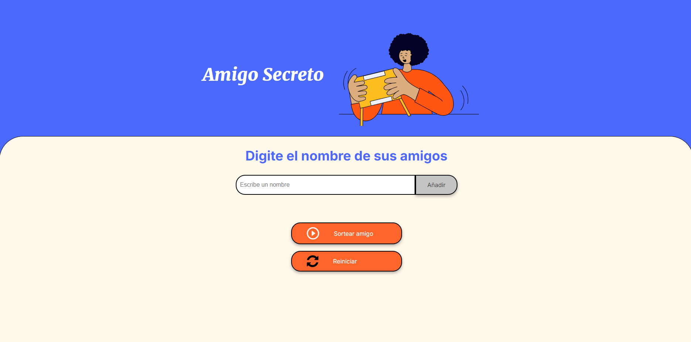
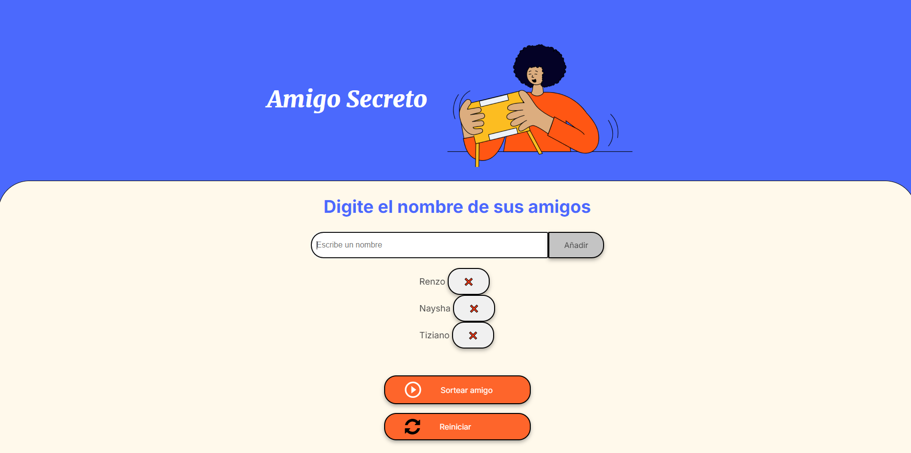
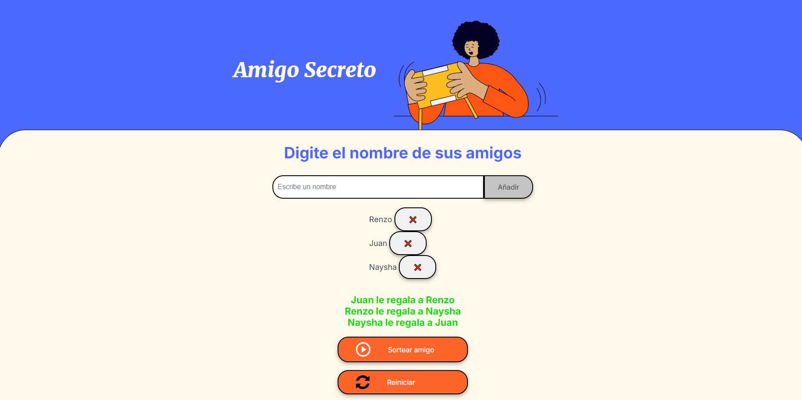

# 🎁 Amigo Secreto - Challenge del Grupo 8 🎉

Un proyecto diseñado para automatizar y personalizar el tradicional juego de "Amigo Secreto". Simplifica el proceso de asignación de participantes y disfruta de una experiencia organizada y libre de errores.

---

## 📋 Funcionalidades

### 🖍 Agregar Participantes

- Interfaz intuitiva para ingresar los nombres de los participantes.
- Validación para evitar duplicados y asegurar que todos los nombres sean únicos.

### 🖀️ Realizar el Sorteo

- Asignación completamente aleatoria.

### 🖥️ Interfaz Amigable

- Página interactiva para gestionar el juego de manera visual y sencilla.
- Diseño responsivo para su uso en dispositivos móviles y de escritorio.

---

## 🚀 ¿Cómo usarlo?

1. **Clona este repositorio**:

   ```bash
   git clone https://github.com/LobitomasterRe/challenge-amigo-secreto.git
   ```

2. **Accede a la aplicación** en tu navegador abriendo el index.html.

---

## 📸 Capturas de Pantalla

1. **Página de Inicio**
   

2. **Agregar Participantes**
   

3. **Resultados del Sorteo**
   

---

## 🎥 Video Demo

[Mira el video aquí](assets/video.mp4)

---

## 👤 Autor

**Renzo García Auqui** - _Grupo 8_

Si tienes sugerencias o encuentras algún error, no dudes en abrir un [issue](https://github.com/LobitomasterRe/challenge-amigo-secreto/issues).
